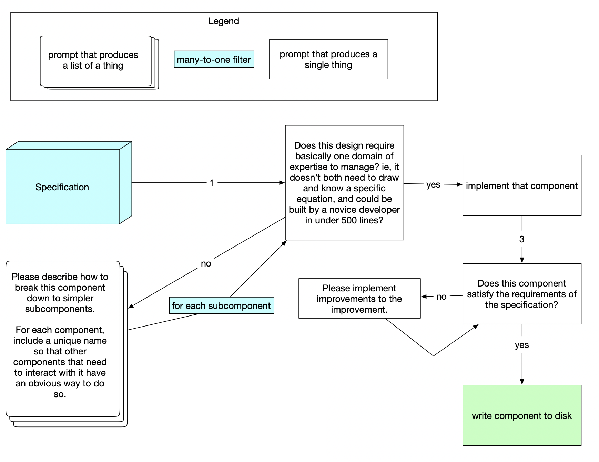

# Module: AI-Assisted Code Generation

This module uses the OpenAI language model and a collection of internal prompts to help generate code based on a given specification. It starts by simplifying the components, implementing them, and then checking for correctness. The module uses caching to speed up the process and avoid repeated computations.



## Prerequisites

- Node.js
- An OpenAI API key

## Dependencies

    langchain
    dotenv
    crypto
    fs/promises
    util

## Usage

    Install the required dependencies:

```
npm install
```

Add your OpenAI API key to a .env file in the root directory:

```
OPENAI_API_KEY=your_api_key_here
```

Run the module with:

```
    node index.js
```

The module will read the specification from ./specification/product-goal.md and additional documents from specification/additional-docs/. It will then create implementation files in the ./implementation/ directory.

## Main Functions

    start(): The main function that orchestrates the code generation process.
    splitIfPossible(item): Splits the given item into subcomponents if it is not simple enough.
    processItem(item): Recursively processes the item by calling splitIfPossible(item) and handling the result.
    promptWithTemplate(model, opts): Prompts the language model with a template and input variables, returns the result.
    cacheOrExecute(jsonArgument, executeFunction): Caches the result of a function call or returns the cached data if it exists.
    rawPrompt(model, opts): Sends a raw prompt to the language model and returns the result.

## Internal Prompts

The module uses the following internal prompts to guide the language model:

    Smallness Checker: Determines if a given specification is simple enough.
    Subdivider: Subdivides a specification into smaller components.
    Developer: Implements the given specification.
    Correctness Checker: Checks if the implementation is correct based on the specification.
    Improver: Suggests improvements for the implementation.
    Namer: Names the implemented component.

## Cache

The module uses a caching mechanism to store the results of previous prompts in the ./cache/ directory. This helps avoid unnecessary computations and speeds up the overall process.
Limitations

The generated code might not be entirely correct or optimal. The module tries to improve the implementation and checks for correctness, but there is a limit to the number of attempts. It is recommended to review the generated code before integrating it into your project.